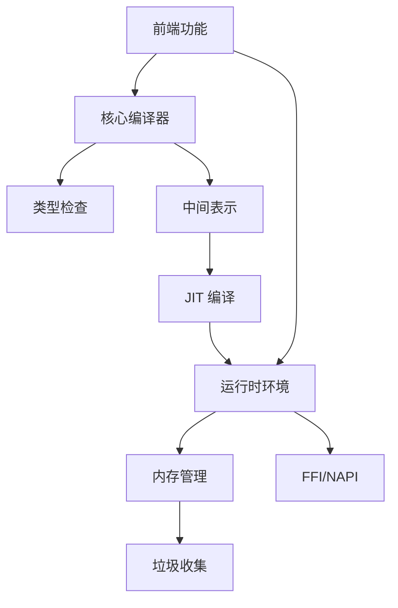

# Rusty-TypeScript 架构设计文档

## 1. 项目概述

Rusty-TypeScript 是一个用 Rust 实现的 TypeScript 运行时项目，目标是超越 V8，提供高性能、低内存使用的 TypeScript 执行环境。

## 2. 整体架构

Rusty-TypeScript 采用多层级编译架构，主要包含以下核心模块：

```
┌─────────────────────────────────────────────────────────────────────────────┐
│                                  前端层                                   │
│ ┌─────────────────┐  ┌─────────────────┐  ┌─────────────────┐            │
│ │ TypeScript      │  │ 文档网站        │  │ 用户界面        │            │
│ │ Playground      │  │                 │  │                 │            │
│ └─────────────────┘  └─────────────────┘  └─────────────────┘            │
├─────────────────────────────────────────────────────────────────────────────┤
│                                接口层                                    │
│ ┌─────────────────┐  ┌─────────────────┐  ┌─────────────────┐            │
│ │ FFI 接口        │  │ NAPI 实现       │  │ 跨平台支持      │            │
│ └─────────────────┘  └─────────────────┘  └─────────────────┘            │
├─────────────────────────────────────────────────────────────────────────────┤
│                                编译层                                    │
│ ┌─────────────────┐  ┌─────────────────┐  ┌─────────────────┐  ┌─────────┐ │
│ │ 核心编译器      │  │ 中间表示 (IR)  │  │ JIT 编译        │  │ 类型检查 │ │
│ └─────────────────┘  └─────────────────┘  └─────────────────┘  └─────────┘ │
├─────────────────────────────────────────────────────────────────────────────┤
│                                运行时层                                  │
│ ┌─────────────────┐  ┌─────────────────┐  ┌─────────────────┐  ┌─────────┐ │
│ │ 运行时环境      │  │ 内存管理        │  │ 垃圾收集        │  │ 性能优化 │ │
│ └─────────────────┘  └─────────────────┘  └─────────────────┘  └─────────┘ │
└─────────────────────────────────────────────────────────────────────────────┘
```

## 3. 模块职责与关系

### 3.1 核心编译器

**职责**：
- TypeScript 词法分析和语法分析
- AST 构建
- 代码生成
- 错误处理

**文件位置**：`compilers/typescript/src/lib.rs`

**关系**：
- 接收 TypeScript 源代码作为输入
- 生成 AST 并传递给类型检查模块
- 将 AST 转换为中间表示并传递给 IR 模块

### 3.2 中间表示 (IR)

**职责**：
- 定义 IR 结构
- 序列化/反序列化功能
- 优化 pass
- 代码生成

**文件位置**：`compilers/typescript-ir/src/lib.rs`

**关系**：
- 接收来自核心编译器的 AST
- 生成优化后的 IR 代码
- 将 IR 传递给 JIT 编译模块

### 3.3 JIT 编译

**职责**：
- 代码生成
- 优化策略
- 执行引擎
- 性能优化

**文件位置**：`compilers/typescript/src/jit/mod.rs`

**关系**：
- 接收来自 IR 模块的中间表示
- 生成可执行代码
- 与运行时环境交互执行代码

### 3.4 类型检查

**职责**：
- 类型系统设计
- 类型检查逻辑
- 类型推断
- 泛型支持
- 类型错误处理
- 类型优化

**文件位置**：`compilers/typescript/src/type_checker/mod.rs`

**关系**：
- 接收来自核心编译器的 AST
- 执行类型检查
- 生成类型错误信息

### 3.5 运行时环境

**职责**：
- 运行时结构
- 对象系统
- 内置函数库
- 异常处理
- 模块系统

**文件位置**：`compilers/typescript/src/vm/mod.rs`

**关系**：
- 与 JIT 编译模块交互执行代码
- 管理运行时状态
- 提供内置函数和对象

### 3.6 内存管理

**职责**：
- 内存分配器设计
- 内存池
- 对象池
- 内存碎片整理
- 内存使用监控

**文件位置**：`compilers/typescript/src/memory/mod.rs`

**关系**：
- 为运行时环境提供内存分配服务
- 与垃圾收集模块协作管理内存

### 3.7 垃圾收集

**职责**：
- 标记-清除算法
- 引用计数
- 分代收集
- 并发收集

**文件位置**：`compilers/typescript/src/gc/mod.rs`

**关系**：
- 与内存管理模块协作
- 回收不再使用的内存

### 3.8 FFI/NAPI

**职责**：
- FFI 接口架构
- NAPI 实现
- 跨平台支持
- 与 Node.js 的集成

**文件位置**：
- FFI 接口：`compilers/typescript/src/ffi/mod.rs`
- NAPI 实现：`compilers/typescript/src/ffi/napi.rs`
- 跨平台支持：`compilers/typescript/src/platform/mod.rs`

**关系**：
- 为外部系统提供接口
- 与运行时环境交互

### 3.9 前端功能

**职责**：
- TypeScript Playground
- 文档网站
- 用户界面
- 代码编辑器集成
- 实时编译和调试

**文件位置**：
- TypeScript Playground：`frontends/homepage/src/components/TypeScriptPlayground.vue`
- 文档网站：`frontends/homepage/src/components/MarkdownViewer.vue`
- 用户界面：`frontends/homepage/src/App.vue`

**关系**：
- 与核心编译模块交互
- 提供用户友好的界面

## 4. 数据流

1. **源代码输入**：用户编写的 TypeScript 代码
2. **词法和语法分析**：核心编译器将源代码转换为 AST
3. **类型检查**：类型检查模块对 AST 进行类型分析
4. **IR 生成**：核心编译器将 AST 转换为中间表示
5. **IR 优化**：IR 模块对中间表示进行优化
6. **JIT 编译**：JIT 编译器将优化后的 IR 转换为可执行代码
7. **执行**：运行时环境执行编译后的代码
8. **内存管理**：内存管理和垃圾收集模块管理内存使用
9. **FFI 调用**：需要时通过 FFI/NAPI 与外部系统交互
10. **前端交互**：前端界面展示执行结果和提供用户操作

## 5. 架构特点

- **多层级设计**：清晰的模块划分和职责分离
- **高性能**：使用 Rust 语言实现，充分利用系统资源
- **低内存使用**：优化的内存管理和垃圾收集策略
- **First Class TypeScript 支持**：原生支持 TypeScript 语法和类型系统
- **跨平台**：支持多平台部署
- **可扩展性**：模块化设计便于添加新功能

## 6. 技术栈

- **核心实现**：Rust
- **前端**：Vue.js
- **构建系统**：Cargo (Rust), pnpm (前端)
- **测试框架**：Rust 测试框架, Jest (前端)

## 7. 未来发展

- **性能优化**：持续改进 JIT 编译和内存管理
- **功能扩展**：支持更多 TypeScript 特性
- **生态系统**：构建完整的 TypeScript 运行时生态
- **工具链**：提供丰富的开发和调试工具

## 8. 模块依赖关系



## 9. 关键设计决策

- **选择 Rust**：利用 Rust 的内存安全和性能优势
- **多层级编译**：分离编译过程，便于优化和维护
- **First Class TypeScript**：原生支持 TypeScript，无需转译
- **JIT 编译**：提供高性能的执行环境
- **垃圾收集**：自动管理内存，减少内存泄漏
- **跨平台**：支持多种操作系统和环境

## 10. 总结

Rusty-TypeScript 采用模块化、多层级的架构设计，旨在提供高性能、低内存使用的 TypeScript 执行环境。各模块职责明确，相互协作，共同实现超越 V8 的目标。通过清晰的架构设计，项目具有良好的可维护性和可扩展性，为未来的发展奠定了坚实的基础。